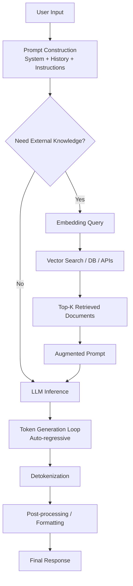
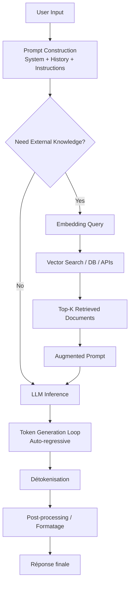

<!-- LANG:EN -->

## Definition

A Chat LLM is a system that allows a user to send a message in natural language and receive a response automatically generated by a language model.

**The key point:** an LLM doesn't "understand" in the human sense — it predicts the next token from a given context.

---

## Global pipeline

```
User Input
→ Prompt Construction (system + history + instructions)
→ [Optional] Retrieval (RAG)
→ LLM (inference)
→ Generation (token by token)
→ Post-processing
→ Response
```

---

## 1. User Input

Message sent by the user in natural language. Can include:
- a question
- an instruction
- business context

---

## 2. Prompt Construction Layer

**Critical step — often invisible.**

The system assembles a final prompt by combining:
- the user's message
- conversation history
- system prompt (rules, role, tone)
- constraints (format, safety, etc.)

```
Final Prompt = System + History + User Input
```

---

## 3. Retrieval (RAG) — Optional

**Important: this is not always used.**

When to use it:
- need for up-to-date information
- specific documents (PDF, internal knowledge base…)
- knowledge outside the model's training data

**RAG pipeline:**

```
User Query
→ Embedding
→ Vector Search / DB / API
→ Top-K documents
→ Injection into prompt
```

> The model doesn't "go fetch" the information itself — the context is injected into it.

**Key insight:** RAG is a component external to the LLM, not a native capability of the model.

---

## 4. LLM Core (Inference)

### 4.1 Tokenization

Text → Tokens

```
"Hello world" → ["Hello", " world"]
```

### 4.2 Embedding

Tokens → numerical vectors + positional encoding

### 4.3 Transformer (model core)

Stack of layers, each with:
- **self-attention**: each token "looks at" the others to build context
- **feedforward**: per-token transformation

### 4.4 Attention Mechanism

Weights the importance of each word relative to the others.

```
"it" → linked to "the cat"
```

### 4.5 Inference

Computes the probability distribution over the next token:

```
P(token | context)
```

### 4.6 Decoding Strategy

Chooses the next token from the distribution:

| Strategy | Behavior |
|---|---|
| Greedy | Always picks the most probable token |
| Top-k | Samples from the k most probable |
| Top-p (nucleus) | Samples from the smallest set covering probability p |
| Temperature | Scales the distribution (↑ creative, ↓ precise) |

Direct impact on: creativity, precision, hallucination rate.

---

## 5. Generation Loop (Auto-regressive)

```
Token → appended to context → next token prediction → repeat
```

The model generates one token at a time, conditioning each new token on everything that came before.

---

## 6. Post-processing

- Detokenization (tokens → text)
- Formatting (markdown, structured output)
- Optional filters (safety, PII, etc.)

---

## 7. Response

Final response displayed to the user — sometimes enriched with UI elements, images, or tool results.

---

## Two modes to distinguish

### Mode 1 — Simple Chat (without RAG)

```
User → Prompt → LLM → Answer
```

Based solely on:
- the model's weights
- the conversational context

### Mode 2 — Chat with RAG

```
User
→ Retrieval (docs, DB, search)
→ Enriched prompt
→ LLM
→ Answer
```

Used for: precision, fresh data, business context.

---

## Fundamental insight

**An LLM is not a database, nor a search engine.**

It is: **a probabilistic text generation engine conditioned on a context.**

### Common mistakes

| Wrong | Correct |
|---|---|
| "The LLM goes and fetches the info" | The LLM generates from its weights + context |
| "The LLM understands like a human" | It predicts the next token statistically |
| "RAG = LLM" | RAG is a separate retrieval layer, optional |

### Correct mental model

- **LLM** = generation engine
- **RAG** = retrieval engine (optional)
- **Product** = orchestration of both

---

## Why add RAG?

RAG allows enriching the model's context with data external to its training, at query time. **It doesn't replace the LLM — it augments it.**

### Main use cases

| Use case | Why RAG |
|---|---|
| Private data access | Internal docs, PDFs, CRM — impossible for LLM alone |
| Data freshness | News, prices, regulations — LLMs have a training cutoff |
| Hallucination reduction | Model grounds answers in real documents |
| Business context | Internal jargon, procedures, client-specific knowledge |
| Traceability | Cite sources, audit answers — critical in enterprise |

### Trade-offs

- **Added complexity**: vector DB, embeddings, retrieval pipeline
- **Latency**: retrieval + injection adds time to each request
- **Quality depends on retrieval**: garbage in = garbage out

**Key insight:** RAG transforms a "generalist" LLM into a "specialist" assistant.

---

## Diagram — Chat LLM with / without RAG



<!-- LANG:FR -->

## Définition

Un Chat LLM est un système qui permet à un utilisateur d'envoyer un message en langage naturel et de recevoir une réponse générée automatiquement par un modèle de langage.

**Le point clé :** un LLM ne "comprend" pas au sens humain — il prédit le prochain token à partir d'un contexte.

---

## Pipeline global

```
User Input
→ Prompt Construction (system + history + instructions)
→ [Optionnel] Retrieval (RAG)
→ LLM (inference)
→ Generation (token by token)
→ Post-processing
→ Response
```

---

## 1. User Input

Message envoyé par l'utilisateur en langage naturel. Peut inclure :
- une question
- une instruction
- du contexte métier

---

## 2. Prompt Construction Layer

**Étape critique — souvent invisible.**

Le système assemble un prompt final en combinant :
- le message utilisateur
- l'historique de conversation
- le system prompt (règles, rôle, ton)
- des contraintes (format, sécurité, etc.)

```
Final Prompt = System + History + User Input
```

---

## 3. Retrieval (RAG) — Optionnel

**Important : ce n'est pas toujours utilisé.**

Quand l'utiliser :
- besoin d'information à jour
- documents spécifiques (PDF, base interne…)
- connaissance hors modèle

**Pipeline RAG :**

```
User Query
→ Embedding
→ Vector Search / DB / API
→ Top-K documents
→ Injection dans le prompt
```

> Le modèle ne "va pas chercher" l'information lui-même — on lui injecte le contexte.

**Insight clé :** le RAG est une brique externe au LLM, pas une capacité native du modèle.

---

## 4. LLM Core (Inference)

### 4.1 Tokenization

Texte → Tokens

```
"Bonjour monde" → ["Bonjour", " monde"]
```

### 4.2 Embedding

Tokens → vecteurs numériques + positional encoding

### 4.3 Transformer (cœur du modèle)

Empilement de couches, chacune avec :
- **self-attention** : chaque token "regarde" les autres pour construire le contexte
- **feedforward** : transformation par token

### 4.4 Attention Mechanism

Pondère l'importance de chaque mot par rapport aux autres.

```
"il" → relié à "le chat"
```

### 4.5 Inference

Calcule la distribution de probabilité sur le prochain token :

```
P(token | contexte)
```

### 4.6 Decoding Strategy

Choisit le prochain token à partir de la distribution :

| Stratégie | Comportement |
|---|---|
| Greedy | Toujours le token le plus probable |
| Top-k | Échantillonne parmi les k plus probables |
| Top-p (nucleus) | Échantillonne dans le plus petit ensemble couvrant la probabilité p |
| Temperature | Échelonne la distribution (↑ créatif, ↓ précis) |

Impact direct sur : créativité, précision, taux d'hallucination.

---

## 5. Generation Loop (Auto-regressive)

```
Token → ajouté au contexte → prédiction du prochain token → répéter
```

Le modèle génère un token à la fois, en conditionnant chaque nouveau token sur tout ce qui précède.

---

## 6. Post-processing

- Détokenisation (tokens → texte)
- Formatage (markdown, sortie structurée)
- Filtres optionnels (sécurité, données personnelles, etc.)

---

## 7. Response

Réponse finale affichée à l'utilisateur — parfois enrichie d'éléments UI, d'images ou de résultats d'outils.

---

## Deux modes à distinguer

### Mode 1 — Chat simple (sans RAG)

```
User → Prompt → LLM → Answer
```

Basé uniquement sur :
- les poids du modèle
- le contexte conversationnel

### Mode 2 — Chat avec RAG

```
User
→ Retrieval (docs, DB, search)
→ Prompt enrichi
→ LLM
→ Answer
```

Utilisé pour : précision, données fraîches, contexte métier.

---

## Insight fondamental

**Un LLM n'est pas une base de données ni un moteur de recherche.**

C'est : **un moteur de génération probabiliste de texte conditionné par un contexte.**

### Erreurs fréquentes

| Incorrect | Correct |
|---|---|
| "Le LLM va chercher l'info" | Le LLM génère depuis ses poids + le contexte |
| "Le LLM comprend comme un humain" | Il prédit le prochain token statistiquement |
| "RAG = LLM" | Le RAG est une couche de récupération séparée, optionnelle |

### Modèle mental correct

- **LLM** = moteur de génération
- **RAG** = moteur de récupération (optionnel)
- **Produit** = orchestration des deux

---

## Pourquoi ajouter du RAG ?

Le RAG permet d'enrichir le contexte du modèle avec des données externes à son entraînement, au moment de la requête. **Il ne remplace pas le LLM — il l'augmente.**

### Cas d'usage principaux

| Cas d'usage | Pourquoi RAG |
|---|---|
| Accès à des données privées | Docs internes, PDF, CRM — impossible pour un LLM seul |
| Fraîcheur des données | Actualités, prix, réglementations — les LLM ont un cutoff |
| Réduction des hallucinations | Le modèle s'appuie sur des documents réels |
| Contexte métier | Jargon interne, procédures, connaissance client |
| Traçabilité | Citer les sources, auditer les réponses — crucial en entreprise |

### Trade-offs

- **Complexité supplémentaire** : vector DB, embeddings, pipeline de retrieval
- **Latence** : récupération + injection ajoute du temps à chaque requête
- **Qualité dépendante du retrieval** : garbage in = garbage out

**Insight clé :** le RAG transforme un LLM "généraliste" en assistant "spécialisé".

---

## Diagramme — Chat LLM avec / sans RAG


